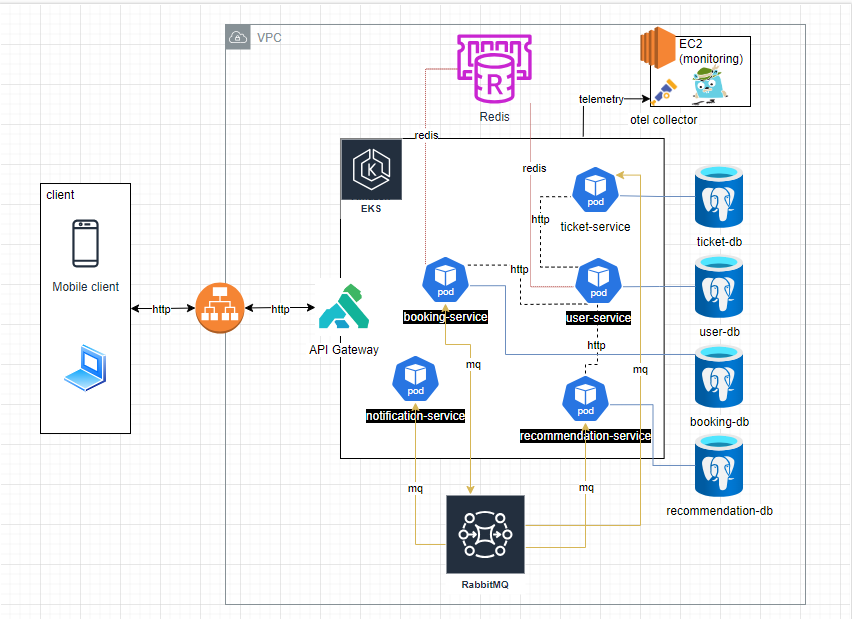
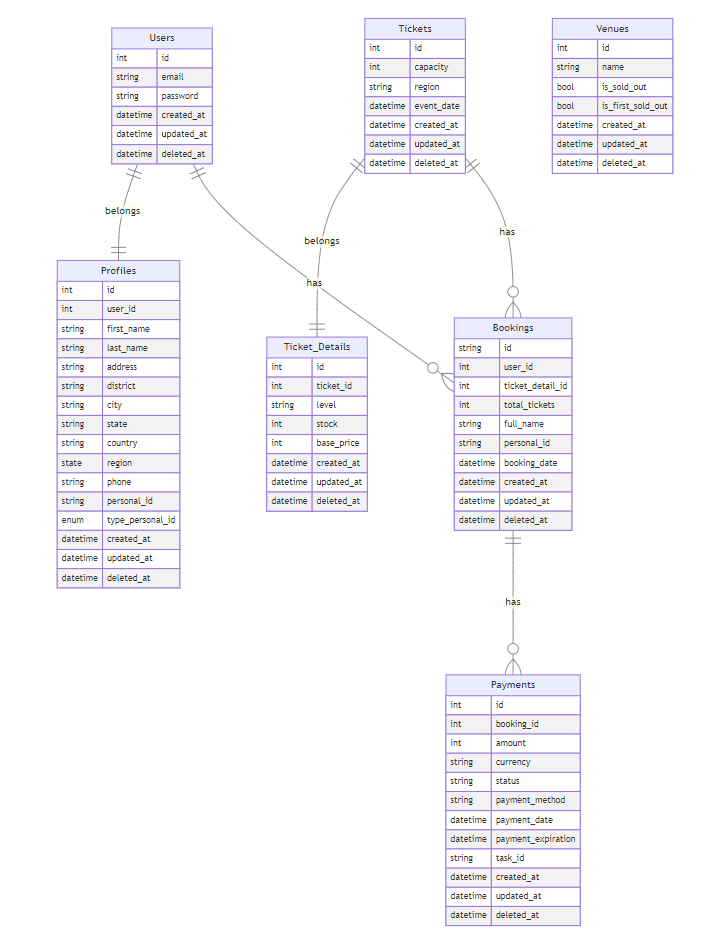
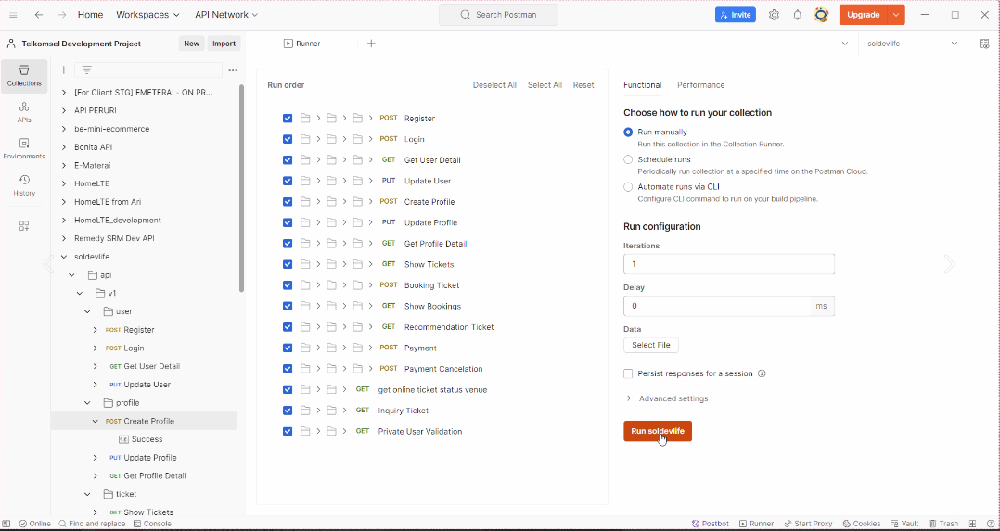
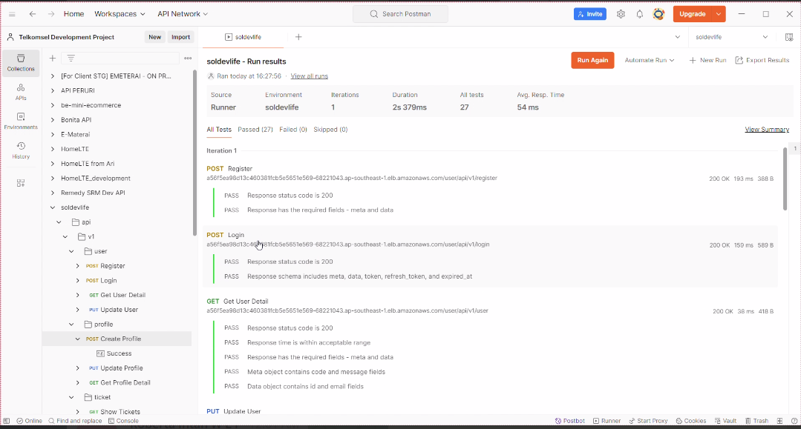
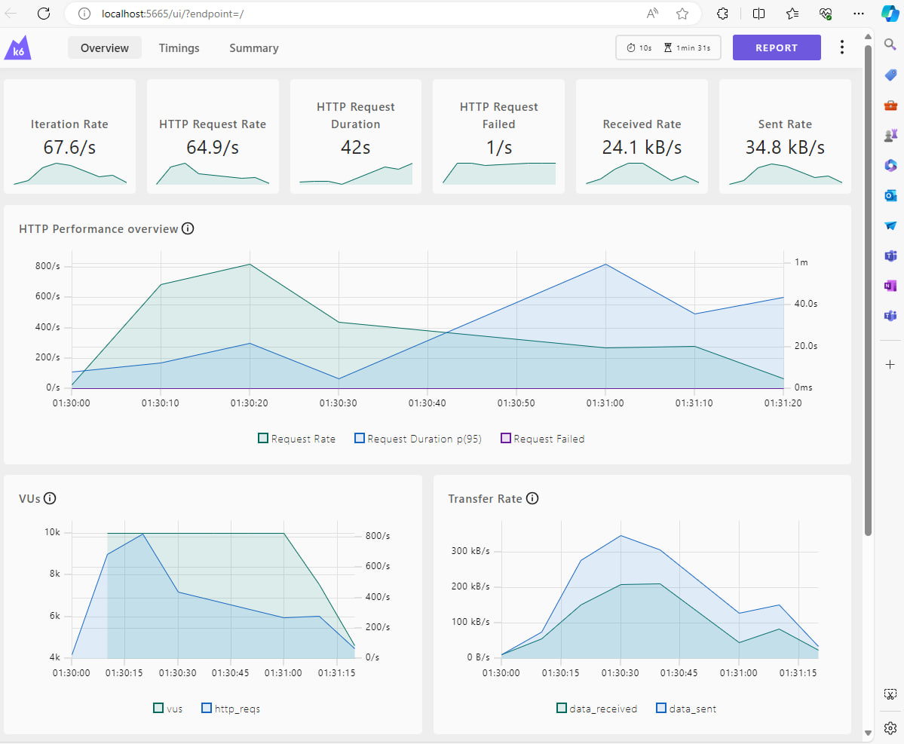
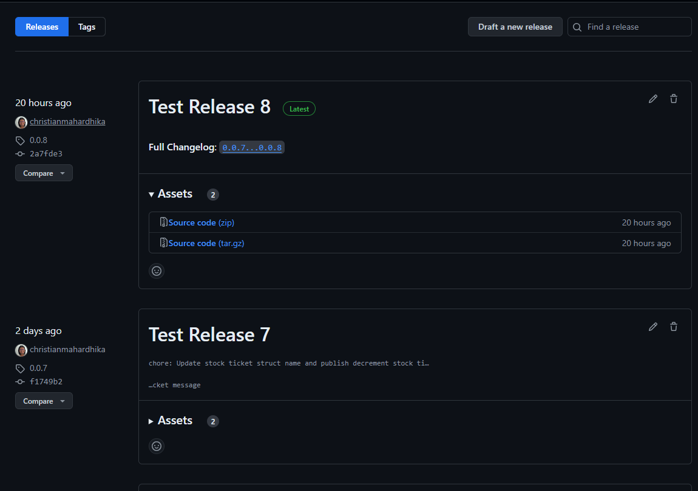
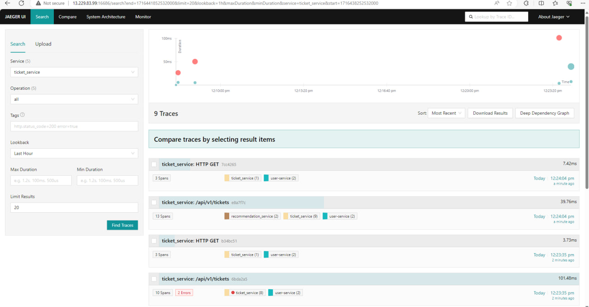
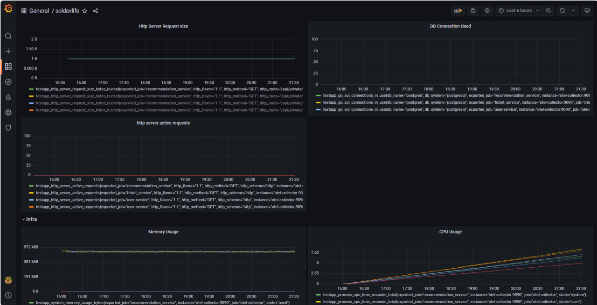

# Soldev Life

## Description

This is a solution for ticketing system problem. The solution is implemented using Go and use GoRules as the rules engine.

## System Design


## ERD


## API Documentation

To view the API documentation, please run the application and go to the following URL:

**Swagger UI**

https://soldevlife-assesment-2024-s1.github.io/.github/

## Run
### How to test

**Security Test**
To perform security test at fww-core service, please run the following command:
```bash
make scan
```
**Unit Test**
To perform unit test at fww-core service, please run the following command:
```bash
make test
```

**E2E Test**
To perform E2E we need to run the following command:

open postman and import the collection from the following file:

[text](soldevlife.postman_collection.json)

Run the collection and check the result.




Result:



**Load Test**
To perform load test, please run the following command:
```bash
git clone https://github.com/soldevlife-assesment-2024-s1/sre.git
```

```bash
cd sre/load_test
```

we are using k6 to perform the load test, please install k6 from the following link:
https://k6.io/docs/getting-started/installation/


run the following command to perform the load test:
```bash
k6 run --summary-trend-stats="med,p(95),p(99.9)" --out web-dashboard script.js
```

**Open the dashboard link that will generate by k6 to see the result:**




## How to deploy

**Release Application**

To release the application, please run create a new release tag on github repository. The release tag will trigger the CI/CD pipeline to build and deploy the application.



**Run at kubernetes**
This solution is deployed using Kubernetes. To deploy the solution, please follow the following steps:

1. Clone the repository to your local machine that will be used to deploy the solution.

2. Change the directory to the repository directory.

```bash
cd deployment/kubernetes
```

3. Run the following command to deploy the solution to the Kubernetes cluster:


```bash
kubectl apply -f deployment.yaml
```

4. To check the status of the deployment, run the following command:

```bash
kubectl get pods
```

## How to monitor

This application is tooled with opentelemetry to observe the application performance. To monitor we are using Jaeger for tracing and Prometheus for metrics.

**Jaeger**


**Grafaana**
